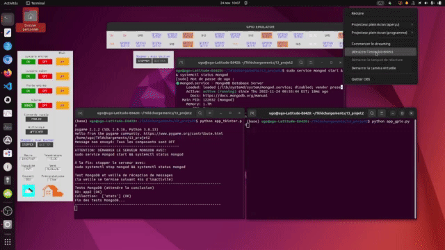

# Domotique avec commandes vocales et Tkinter sur des Raspberry Pi

Des projets proches des projets Système d'alarme avec un Raspberry Pi: <a href="https://github.com/ugolabo/systeme_alarme_rpi">bouton droit vers repo</a>

1. [Projet, v1](#projet-v1-commandes-avec-boutons)
2. [Projet, v2](#projet-v2-ajout-des-commandes-vocales-et-plus)

## Projet, v1: commandes avec boutons

**Objectif:** maitriser les fondements des nanoordinateurs (Raspberry Pi), des OS Linux (Raspbian, mais aussi Ubuntu, les CLI) et de montages, d'un émulateur Raspberry Pi (RpiSim) pour OS Linux, du langage Python embarqué, de concepts les fils d'exécution (*thread*), des évènements sur le système, de la conception d'interfaces graphiques (avec Tkinter), du protocole MQTT (avec un serveur Mosquitto et le service web MyQTT Hub) pour acheminer les données, colliger les transactions dans une base de données MongoDB pour garder l'historique des commandes et plus afin de construire des projets simples en IoT et de pouvoir collaborer avec des spécialistes de ces domaines dans des projets avancés.

Consulter le README du projet (dans le projet) pour plus de détails. À noter que le fichier cles.py du projet contient des valeurs pour s'authentifier à MyQTT Hub, mais ces valeurs sont factices; il faut les changer.

**Description:** l'interface graphique du 1er Raspberry Pi permet de piloter un 2e Raspberry Pi à distance. Ce dernier pilote des objets connectés. En domotique, les objets peuvent être des lampes (allumer-éteindre), des ventilateurs (allumer-éteindre), des stores (monter-descendre), des portes (ouvrir-fermer ou verrouiller-déverrouiller), un système d'alarme (armer-désarmer), etc. L'interface du 1er Raspberry Pi montre les boutons de commande et les états des objets connectés. L'exécution de chaque commande devient un message MQTT qui passe par le web. Une fois la commande reçue et décodée par le 2e Raspberry Pi, ce dernier change l'état d'un objet (d'allumé à éteint, par exemple). Le 2e Raspberry Pi renvoie une confirmation du changement d'état avec un nouveau message MQTT. Une fois la changement d'état reçu et décodé par le 1er Raspberry Pi, ce dernier change l'affichage de l'état sur l'interface. L'exécution de chaque commande est gardée dans une base de données comme historique.

## Projet, v2: ajout des commandes vocales et plus

**Objectif:** poursuivre avec la programmation embarquée et la programmation orientée objet en Python pour bonifier l'interface graphique (avec Tkinter), l'ajouter d'un bouton pour dicter des commandes vocales et incorporer des données météo récupérées sur le web avec l'API OWM afin de les afficher sur l'interface

Consulter le README du projet pour plus de détails. À noter que le fichier cles.py du projet contient des valeurs pour s'authentifier à MyQTT Hub, mais ces valeurs sont factices; il faut les changer. À noter aussi les fichiers PDF de conjugaison pour varier (tester) les commandes vocales.

Télécharger la vidéo (dossier vid) pour une une meilleure résolution.

**Description:** le 1er Raspberry Pi fonctionne aussi avec des commandes vocales; les mêmes que pour les boutons (allumer-éteindre, armer-désarmer, etc.). Un module de reconnaissance vocale de Google (via le web) convertit l'oral (d'un micro) en texte. Il existe diverses façons de dicter une commande. Par exemple, dicter l'allumage d'une lampe peut se faire avec différents verbes (ouvrir, allumer, etc.), à différents temps de conjugaison, avec diverses constructions syntaxiques. Bref, il n'y a pas de phrase standard. Pour standardiser une commande vocale et la faire fonctionner, il faut du TALN (*NLP*). La phrase de commande subit des modifications : des modules comme NLTK, TextBlob et SpaCy enlèvent les stopwords, réduisent la phrase en tokens, puis en lemmes. Un lemme est un mot qui a perdu tout accord ou conjugaison. Les éléments de la phrase réduite sont comparés à des ensembles de mots (des noms non accordés et des verbes à l'infinitif, par exemple) pour retrouver une commande existante. Si la commande existe, cette dernière devient un message MQTT acheminé jusqu'au 2e Raspberry Pi comme avec un bouton de commande. De plus, une énonciation standard de la commande est retournée sous forme de texte, puis convertie en énonciation orale (sauvegardée en MP3 ou WAV) avec des modules comme PicoTTS et d'autres de Google. L'interface du 1er Raspberry Pi est aussi bonifiée avec l'heure du 1er Rapsberry Pi et des données météo récupérées du web avec l'API OWM au moment où l'application fonctionne.
