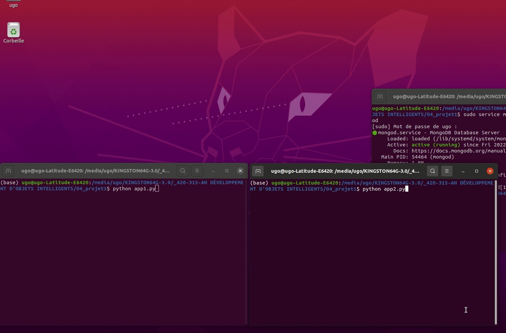

# Domotique avec commandes vocales et Tkinter sur des Raspberry Pi

Les deux projets fonctionnent avec un émulateur de Raspberry Pi sur un système d'exploitation Ubuntu et des codes sources Python. La distribution Ubuntu (pour ordinateur) comme Raspbian et les autres distributions Linux pour (nanoordinateur) Raspberry Pi descendent de la distribution Debian. Le développement sur ordinateur sous Ubunbu est reproduisible sur Raspberry Pi.

Le projet 1 est une étape dans la poursuite du projet 2, plus sophistiqué.

## Projet 1: mise en place et structure

Un aperçu de la structure.

- Serveur MongoDB local.
    - Le serveur est lancé par CLI dans le terminal partiellement caché.
    - Un fichier 'app_mongo.py' sert à faire des opérations CRUD sur un client de cette base de données pour récupérer l'historique, par exemple.
- Interface graphique du premier Raspberry Pi (code source 'app1.py').
    - Le code source s'exécute dans le terminal de gauche.
    - L'interface graphique Tkinter montre l'exécution des boutons à gauche et le changement d'état à droite.
    - Chaque changement d'état est tiré de l'exécution du code source dont on voit l'affichage dans le terminal.
    - Chaque changement d'état crée à la fois une entrée dans la base de données MongoDB locale (via un client) et une communication avec le protocole MQTT vers le service web MyQTT Hub via un serveur Mosquitto.
    - Un bouton permet d'afficher l'historique tiré de la base de données MongoDB.
- Émulateur graphique de GPIO (broches) du second Raspberry Pi (code source 'app2.py').
    - Le code source s'exécute dans le terminal de droite.
    - L'émulateur graphique montre le changement d'état (0V-5V) des broches du Raspberry Pi.
    - Ce dernier pilote des objets connectés. En domotique, les objets peuvent être des lampes (allumer-éteindre), des ventilateurs (allumer-éteindre), des stores (monter-descendre), des portes (ouvrir-fermer ou verrouiller-déverrouiller), un système d'alarme (armer-désarmer), etc.
    - Chaque changement d'état est tiré de l'exécution du code source dont on voit l'affichage dans le terminal.
    - Chaque changement d'état arrive au Raspberry Pi 2 du Rapsberry Pi 1 via le protocole MQTT (ce qui explique le délai entre le changement de couleur du bouton et celui sur l'émulateur graphique de GPIO parce que le service MyQTT Hub est en ligne).
    - Ce changement d'état du Raspberri Pi 2, seulement si le nanoordinateur est actif et si le changement a lieu, est communiqué au Raspberry Pi 1 via le protocole MQTT (ce qui explique le délai entre le changement de couleur du bouton et celui du changement d'état sur l'interface graphique). Si le changement d'état n'a pas lieu, le système peut capter le non-lieu. Un non-lieu indique que le Raspberry Pi 2 est éteint et que la lampe, par exemple, ne s'est pas allumée.

La programmation préliminaire du projet 1 s'appuie sur des concepts de fils d'exécution (*thread*), de gestion d'évènements, de la conception d'interfaces graphiques (avec Tkinter), de l'utilisation du protocole MQTT (avec un serveur Mosquitto et le service web MyQTT Hub) pour acheminer les données, de collecte de transactions dans une base de données MongoDB pour garder l'historique des commandes, de la maitrise de systèmes d'exploitation, des CLI et du langage Python.

Consulter le README du projet 1 (dans son sous-répertoire) pour plus de détails. À noter que le fichier 'cles.py' contient des valeurs pour s'authentifier à MyQTT Hub, mais ces valeurs sont factices; il faut les changer.

## Projet 2: mise en place et structure

Un aperçu de la structure.

En comparaison au projet 1, le projet 2 ajoute des commandes vocales et bonifie l'affichage graphique.

- Interface graphique bonifié du premier Raspberry Pi.
    - L'interface graphique Tkinter compte plus de boutons pour activer-désactiver les commandes vocales.
    - Une reconnaissance vocale (via le web) convertit l'oral (d'un micro) en texte pour passer la transcription au code source.
    - Il existe diverses façons de dicter une commande. Par exemple, dicter l'allumage d'une lampe peut se faire avec différents verbes (ouvrir, allumer, etc.), à différents temps de conjugaison, avec diverses constructions syntaxiques. Bref, il n'y a pas de phrase standard.
    - Pour standardiser une commande vocale et la faire fonctionner, il faut faire du TALN (*NLP*). La phrase de commande subit des modifications: on enlève les stopwords, on réduit la phrase à des tokens, puis à des lemmes. Un lemme est un mot qui a perdu tout accord ou conjugaison. Les lemmes sont comparés à des ensembles de lemmes pour retrouver une commande existante. Si la commande existe, cette dernière devient un message MQTT.
    - De plus, une énonciation standard de la commande est retournée sous forme de texte, puis convertie en énonciation orale (sauvegardée en fichier sonore). Si la commande vocale n'existe pas ou n'est pas retrouvée, des instructions indiquent à l'usager de recommencer (de changer sa formulation).
    - L'interface graphique Pi est aussi bonifiée avec l'heure tirée du premier Rapsberry Pi et des données météo tirées du web avec l'API OWM au moment où l'application fonctionne.

Consulter le README du projet pour plus de détails. À noter que le fichier 'cles.py' du projet contient des valeurs pour s'authentifier à MyQTT Hub, mais ces valeurs sont factices; il faut les changer. Le README du projet indique le genre de commandes vocales qui fonctionnent. Des PDF de conjugaisons permettent de varier les commandes encore plus. À noter aussi les fichiers PDF de conjugaison pour varier les commandes vocales.

Pour une meilleure résolution, télécharger et visualiser le fichier MP4 (adjacent au README).
