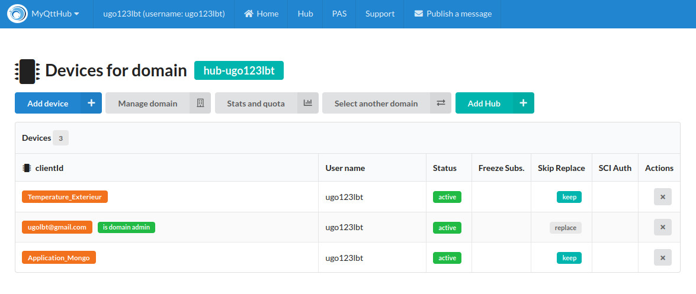
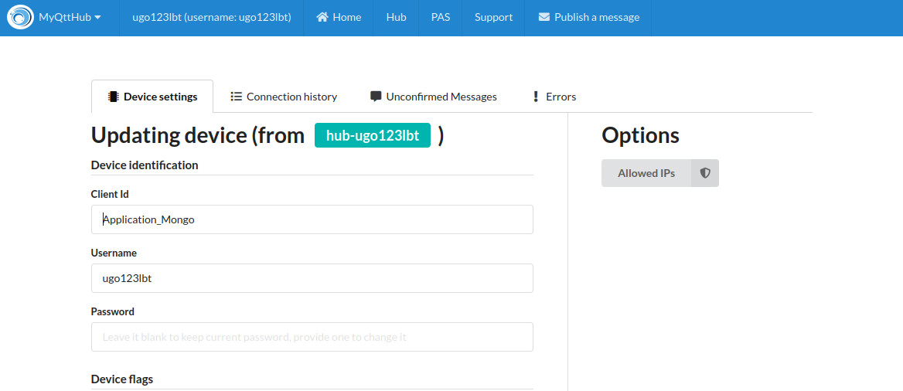
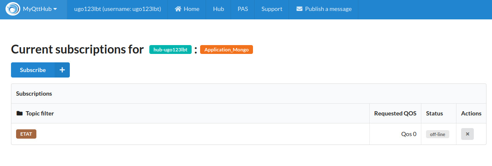

# Projet 1

## Mise en place et structure

- Sous un système d'exploitation Ubuntu 20.04 LTS.
- Installer les logiciels.
    - Mosquitto (`sudo apt install mosquitto`).
        - Mosquitto est le serveur sur service web MyQtt.
        - https://pypi.org/project/paho-mqtt/
    - MongoDB (séquence d'installation à https://www.mongodb.com/docs/manual/tutorial/install-mongodb-on-ubuntu/).
- Python 3.8+
- Modules Python standards.
    - tkinter
    - datetime
    - time
    - sys
    - pprint    
- Modules Python indépendants.
    - paho-mqtt
        - `pip install paho-mqtt`
    - RPiSim
        - Consulter https://github.com/mnpappo/rpisim
    - pymongo
        - Consulter https://www.mongodb.com/docs/manual/tutorial/install-mongodb-on-ubuntu/
        - Consulter https://pypi.org/project/pymongo/
        - `pip install pymongo`

## Organisation du répertoire et exécution

- Placer les codes 'app1.py', 'app2.py' et 'app_mongo.py' dans un répertoire de travail avec ce fichier 'README.md' et le dossier 'RPiSim'.
- Ouvrir trois consoles bash dont les invites de commande pointent vers le répertoire de travail.
- Ouvrir les codes sources 'app1.py', 'app2.py' et 'app_mongo.py' dans un éditeur quelconque.
- Pour le paramétrage en ligne (dans les codes sources `host = "n.myqtthub.com"`), voici les images :

Device (dans les codes sources : `client_id = "name"`).

Paramètres du Device (dans les codes sources : `user_name = "id"`, `password = "hashkey"`).
 

Les options violette, noire et rouge peuvent être gardées à OFF; les autres à ON. La rouge est à OFF contrairement à la photo.

Subscription du Device (dans les codes sources `client.publish("ETAT", str(post))`,`client.subscribe("ETAT")`).

Il est possible de changer d'autres paramètres pour suivre les transmissions en ligne (Connection History), par exemple.

### Démarrage

- Lancer le serveur MongoDB avec `sudo service mongod start && systemctl status mongod` dans la première console et s'assurer qu'il est **actif**.
- Lancer le code source 'app2.py' dans la deuxième console.
    - Une fenêtre RPiSim s'ouvre pour simuler les broches d'un Raspberry Pi (noter les broches actives surlignées en couleur).
    - Ce programme **veille pendant 45s** avant de se terminer par lui-même.
- Lancer ensuite le code source 'app1.py' dans la dernière console.
    - Une fenêtre Tkinter (App1) s'ouvre et offre un menu.
- Utiliser les boutons pour changer les états des composants.
    - Les boutons pilotent les broches du simulateur Raspberry Pi (RPiSim).
    - Faire au moins une vingtaine de changements.
- Constater la transmission des messages de changements d'état entre l'application 1 et 2.
    - Les composants sur le Raspberry Pi doivent être branchés entre les broches 15, 18, 17 et la broche 25. La broche 25 est à HIGH. Les autres broches aussi. "Allumer" composant signifie que les broches 15, 18 et 17 doivent passer à LOW. La broche 25 est un "ground inversé". Par exemple, si l'anode de la LED est reliée à 25 (HIGH), la cathode à la 15 (HIGH) et que la 15 bascule de HIGH à LOW suivant un changement d'état de OFF à ON, le courant va passer de la 25 à la 15 pour allumer la LED.
- Utiliser le bouton pour afficher les changements d'états (une fenêtre Tkinter (App1 - Historique s'ouvre).
- Arrêter d'abord (Ctrl_C dans la console) le code source 'app2.py' ou laisser le programme 2 se terminer par lui-même.
- Arrêter ensuite (Ctrl_C dans la console) le code source 'app1.py' ou fermer la fenêtre principale App1 pour arrêter le programme 1.

### Extraction

- Les transmissions reçues par App2 sont enregistrées dans une base de données et une collection de MongoDB.
- Le code source 'app_mongo.py' offre des lignes de code pour se brancher à la base de données, à la collection et pour faire des extractions.
- **Il n'est pas conseiller** de lancer le code source dans une des consoles ouvertes parce que certaines lignes de code à la fin sont prévues pour **supprimer les données**.
- Il vaut mieux ouvrir le code source dans un éditeur qui permet d'exécuter des parties du code source ou de commenter les lignes `db.etats.delete_many()` et d'autres lignes avant d'exécuter un code source partiel.

### Conclusion

- Fermer tout : les fenêtres des applications si elles sont ouvertes, les consoles et les éditeurs.
- Arrêter le serveur MongoDB avec `sudo systemctl stop mongod && systemctl status mongod`.
