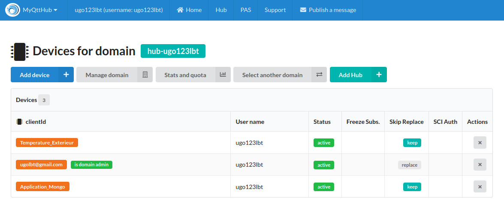
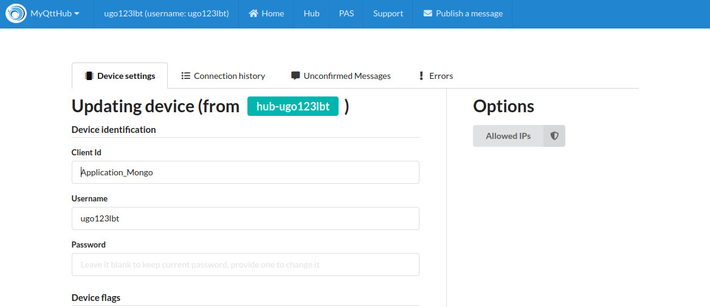
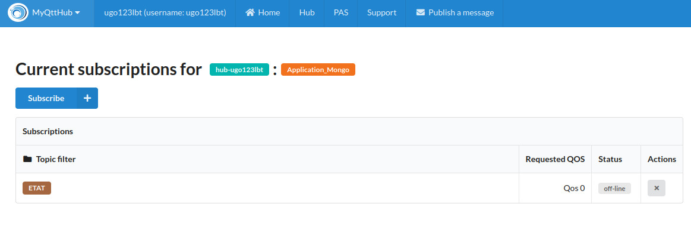

# Projet v1

Une application 1 envoie des messages à une application 2. L'application 1 est un menu pour changer les états de 2 DEL et 1 alarme; ainsi qu'afficher les changements d'état. L'application 2 reçoit les instructions de l'application 1 pour piloter les broches d'un simulateur de Raspberry Pi. L'application 2 exporte aussi les instructions dans une base de données MondoDB. Une troisième application permet de lire et de gérer la base de données MongoDB.

## Condition

- Sous un système d'exploitation Ubuntu 20.04 LTS
- Installer les logiciels
    - Mosquitto (sudo apt install mosquitto)
    - MongoDB (séquence d'installation à https://www.mongodb.com/docs/manual/tutorial/install-mongodb-on-ubuntu/)
- Python 3.8+
- Modules Python standards
    - tkinter
    - datetime
    - time
    - sys
    - pprint    
- Modules Python indépendants
    - paho-mqtt (https://pypi.org/project/paho-mqtt/)
    - RPiSim (https://github.com/mnpappo/rpisim)
    - pymongo (https://pypi.org/project/pymongo/)
 
## Préparation

- Placer les codes `app1.py`, `app2.py` et `app_mongo.py` dans un répertoire de travail avec ce fichier `README.md` et le dossier `RPiSim`
- Ouvrir trois consoles bash dont les invites de commande pointent vers le répertoire de travail
- Ouvrir les codes sources `app1.py`, `app2.py` et `app_mongo.py` dans un éditeur quelconque
- Pour le paramétrage en ligne (dans les codes sources `host = "n.myqtthub.com"`), voici les images:

Device (dans les codes sources `client_id = "name"`)

Paramètres du Device (dans les codes sources `user_name = "id"`, `password = "hashkey"`)
 

Les options violette, noire et rouge peuvent être gardées à OFF; les autres à ON. La rouge est à OFF contrairement à la photo.

Subscription du Device (dans les codes sources `client.publish("ETAT", str(post))`,`client.subscribe("ETAT")`)

Il est possible de changer d'autres paramètres pour suivre les transmissions en ligne (Connection History), par exemple

## Utilisation

- Lancer le serveur MongoDB avec `sudo service mongod start && systemctl status mongod` dans la première console et s'assurer qu'il est **actif**
- Lancer le code source `app2.py` dans la deuxième console
    - Une fenêtre RPiSim s'ouvre pour simuler les broches d'un Raspberry Pi (noter les broches actives surlignées en couleur)
    - Ce programme **veille pendant 45s** avant de se terminer par lui-même
- Lancer ensuite le code source `app1.py` dans la dernière console
    - Une fenêtre Tkinter (App1) s'ouvre et offre un menu
- Utiliser les boutons pour changer les états des composants
    - Les boutons pilotent les broches du simulateur Raspberry Pi (RPiSim)
    - Faire au moins une vingtaine de changements
- Constater la transmission des messages de changements d'état entre l'application 1 et 2
    - Les composants sur le Raspberry Pi doivent être branchés entre les broches 15, 18, 17 et la broche 25. La broche 25 est à HIGH. Les autres broches aussi. "Allumer" composant signifie que les broches 15, 18 et 17 doivent passer à LOW. La broche 25 est un "ground inversé". Par exemple, si l'anode de la LED est reliée à 25 (HIGH), la cathode à la 15 (HIGH) et que la 15 bascule de HIGH à LOW suivant un changement d'état de OFF à ON, le courant va passer de la 25 à la 15 pour allumer la LED.
- Utiliser le bouton pour afficher les changements d'état (une fenêtre Tkinter (App1 - Historique s'ouvre)
- Arrêter d'abord (Ctrl_C dans la console) le code source `app2.py` ou laisser le programme 2 se terminer par lui-même
- Arrêter ensuite (Ctrl_C dans la console) le code source `app1.py` ou fermer le fenêtre principale App1 pour arrêter le programme 1

## Extraction

- Les transmissions reçues par l'application 2 ont été enregistrées dans une base de données et une collection de MongoDB
- Le code source `app_mongo.py` offre des lignes de code pour se brancher à la base de données, à la collection et pour faire des extractions
- **Il n'est pas conseiller** de lancer le code source dans une des consoles ouvertes parce que certaines lignes de code à la fin sont prévues pour **supprimer les données**
- Il vaut mieux ouvrir le code source dans un éditeur qui permet d'exécuter des parties du code source ou de commenter les lignes `db.etats.delete_many()` et d'autres lignes avant d'exécuter un code source partiel

## Conclusion

- Fermer tout: les fenêtres des applications si elles sont ouvertes, les consoles et les éditeurs
- Arrêter le serveur MongoDB avec `sudo systemctl stop mongod && systemctl status mongod`
